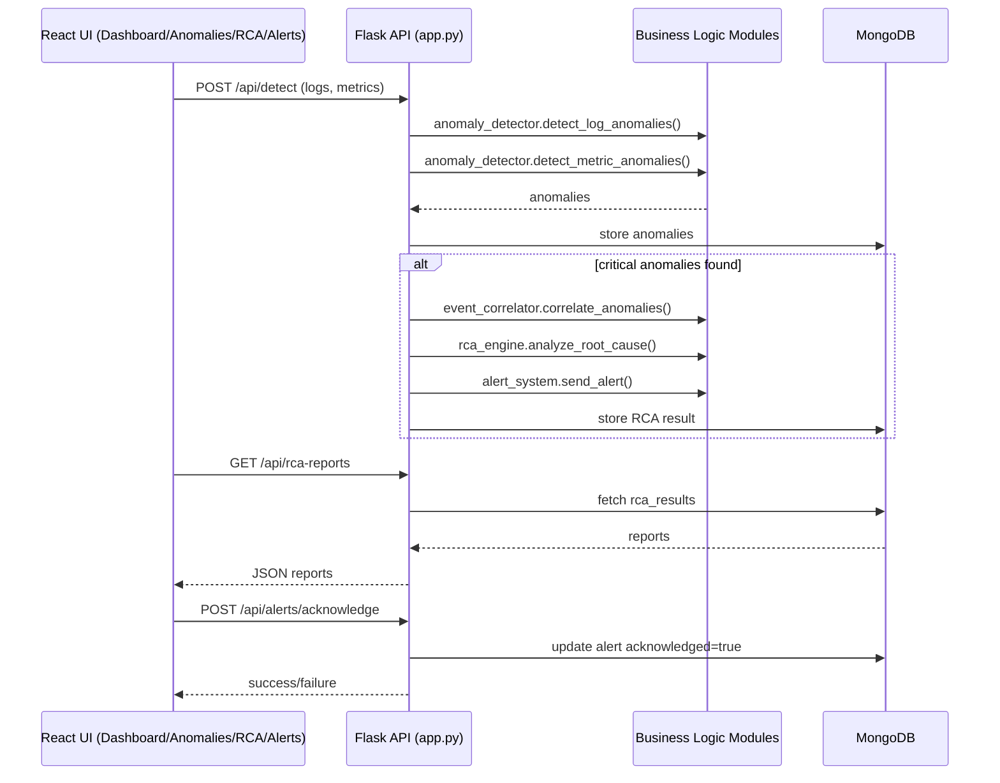

# Assignment 7 Solution - Business Logic Layer (BLL)

**Project:** ARCA (Automated Root Cause Analysis) Platform  
**Student:** Shivankit Jaiswal  
**Based on code in:** `arca-platform/backend` and `arca-platform/frontend`

---

## Q1. Core Functional Modules of BLL and Their Interaction with Presentation Layer

In ARCA, the Business Logic Layer is implemented mainly in `backend/modules`. These modules process incoming logs/metrics, detect anomalies, infer root causes, generate recommendations, and manage alerts.

### 1) Core BLL Modules Implemented

| Module | Role in BLL | Key Methods |
|---|---|---|
| `anomaly_detector.py` | Detects log and metric anomalies using thresholds and statistical behavior | `detect_log_anomalies`, `detect_metric_anomalies` |
| `event_correlator.py` | Groups related anomalies in a time window and computes correlation score | `correlate_anomalies`, `find_related_events` |
| `rca_engine.py` | Applies RCA rules to correlated events and predicts root cause with confidence | `analyze_root_cause`, `apply_rule` |
| `recommendation_engine.py` | Converts root cause into prioritized corrective actions | `generate_recommendations`, `prioritize_recommendations` |
| `alert_system.py` | Creates and manages alerts and acknowledgment state | `send_alert`, `acknowledge_alert` |
| `log_collector.py` | Parses uploaded log files into structured records | `read_new_logs`, `parse_log_entry` |
| `metric_collector.py` | Collects runtime system metrics (CPU, memory, disk, network) | `get_metric_snapshot` |
| `sliding_window.py` | Maintains fixed-size recent-data buffer for stream scenarios | `add`, `get_recent`, `get_by_time_range` |

These modules are instantiated and used in `backend/app.py` through REST endpoints.

### 2) Interaction with Presentation Layer (UI)

The presentation layer is implemented in React pages (`frontend/src/pages`) and service APIs (`frontend/src/services/api.js`).

| UI Component (Presentation Layer) | API Used | BLL Modules Involved | What user sees |
|---|---|---|---|
| `Dashboard.jsx` | `/api/statistics`, `/api/anomalies`, `/api/rca-reports`, `/api/metrics/current` | `metric_collector`, data produced by `anomaly_detector`, `rca_engine`, `alert_system` | Live counts, recent anomalies, recent RCA, metric cards |
| `Anomalies.jsx` | `/api/anomalies` | `anomaly_detector` (producer), DB-backed retrieval | Filterable anomaly table by severity |
| `RCAReports.jsx` | `/api/rca-reports`, `/api/rca/analyze` | `event_correlator`, `rca_engine`, `recommendation_engine` | Root cause, confidence, causal chain, recommendations |
| `Alerts.jsx` | `/api/alerts`, `/api/alerts/acknowledge` | `alert_system` | Alert list, acknowledge action, status updates |
| `SystemHealth.jsx` | `/api/system-health`, `/api/metrics/current` | `metric_collector` + anomaly/RCA summary | Overall health + resource utilization |

### 3) Interaction Diagram (UI -> API -> BLL -> Data)

### 4) Short Flow Example (Implemented in Current Project)

1. User uploads logs or sends logs+metrics from UI.
2. Backend endpoint `/api/detect` invokes `AnomalyDetector`.
3. On critical anomalies, backend calls `EventCorrelator` and `RCAEngine`.
4. `AlertSystem` is triggered for critical events.
5. `RCAReports` and `Alerts` pages fetch processed outputs through REST API and display them.

This proves BLL modules are not isolated utility code; they are integrated into the presentation workflow.

---

## Q2(A). How Business Rules Are Implemented in Different Modules

Business rules in ARCA are implemented as explicit thresholds, rule patterns, severity mapping, prioritization logic, and alerting conditions.

### Rule Set by Module

1. `anomaly_detector.py`
- Rule: If metric value crosses `Threshold.max_value`, anomaly is generated.
- Rule: Severity escalates by percentage breach (LOW/MEDIUM/HIGH/CRITICAL).
- Rule: Log levels `ERROR` and `CRITICAL` always create anomalies.
- Rule: Deployment-related keywords (timeout, rollback, out of memory, permission denied, etc.) increase urgency.

2. `event_correlator.py`
- Rule: Only anomalies within configurable time window are grouped.
- Rule: Correlation score depends on severity composition and dependency relation.
- Rule: Single anomaly in a window is not treated as correlated incident (needs at least 2 anomalies).

3. `rca_engine.py`
- Rule: Root cause is selected by matching anomaly patterns against predefined `Rule` objects.
- Rule: Confidence score is adjusted using average correlation score.
- Rule examples: `DEPLOYMENT_CONFIGURATION_ERROR`, `RESOURCE_EXHAUSTION`, `DATABASE_CONNECTION_FAILURE`, `NETWORK_CONNECTIVITY_ISSUE`, `MEMORY_LEAK`.

4. `recommendation_engine.py`
- Rule: Map each root cause to predefined actions.
- Rule: If confidence > 0.8, medium actions can be promoted to high priority.
- Rule: If confidence < 0.5, high actions may be downgraded to medium.
- Rule: Previously successful fixes are reused as additional recommendations.

5. `alert_system.py`
- Rule: Alert contains standardized fields (id, type, severity, message, timestamp).
- Rule: CRITICAL/HIGH severity alerts trigger stronger notification paths.
- Rule: Acknowledged alerts are removed from active queue.

6. `app.py` orchestration rules
- Rule: RCA and alert path is triggered only when critical anomalies exist in `/api/detect`.
- Rule: Endpoints return structured status and errors (`400`, `404`, `500`) for clear client behavior.

Result: ARCA business behavior is rule-driven and centralized in BLL modules, not mixed inside UI.

---

## Q2(B). Validation Logic Implemented

Yes, validation logic is implemented at multiple levels.

### 1) Input validation in API layer

In `backend/app.py`:
- `/api/detect`: returns `400` if request body is missing.
- `/api/rca/analyze`: returns `400` when `anomaly_ids` is empty.
- `/api/logs/upload`: validates file existence and non-empty filename.
- `/api/alerts/acknowledge`: validates that `alert_id` is provided.

### 2) Constructor/config validation in BLL modules

- `AnomalyDetector.__init__`: raises `ValueError` if thresholds is not a dictionary.
- `RCAEngine.__init__`: raises `ValueError` if rules is not a list.
- `SlidingWindow.__init__`: raises `ValueError` if `max_size <= 0`.

### 3) Type and parsing validation

- Timestamps are validated and converted (`datetime.fromisoformat`) in `anomaly_detector`, `event_correlator`, and `log_collector`.
- If parsing fails, safe fallbacks (`datetime.now()` or skip) are used to avoid crashes.

### 4) UI-level validation and filtering

In React pages:
- Severity filters in `Anomalies.jsx`.
- Confidence filter and search in `RCAReports.jsx`.
- Action-state safeguards like disabled buttons while acknowledging alerts in `Alerts.jsx`.

### 5) Authentication validation

`backend/app.py` has token validation utilities and decorators (`require_auth`, `require_admin`) to enforce secure access when enabled through Clerk JWT configuration.

Conclusion: The system validates incoming data, configuration integrity, and operational state before business processing.

---

## Q2(C). Data Transformation from Data Layer to Presentation Layer

ARCA performs explicit data transformation so backend/domain data can be rendered directly by UI components.

### 1) Domain object -> JSON transformation

- `Anomaly.to_dict()` converts class objects into JSON-serializable dictionaries (`id`, `type`, `severity`, `value`, `metric`, `timestamp`, `description`).
- `AlertSystem._alert_to_dict()` transforms alert objects for API responses/history.

### 2) Datetime transformation

- Datetime objects are converted to ISO strings (`timestamp.isoformat()`) before storage and response.
- React converts these to readable formats with `new Date(...).toLocaleString()`.

### 3) Database identifier transformation

- MongoDB `_id` values are converted to string in endpoint responses so the frontend can safely render/use them.

### 4) Aggregation/shape transformation for UI

- `/api/system-health` combines metrics, statistics, and recent anomalies into one response object suitable for `SystemHealth.jsx`.
- `/api/statistics` transforms raw collection counts into dashboard summary cards.

### 5) Recommendation transformation

- `RecommendationEngine.generate_recommendations()` outputs normalized recommendation dictionaries.
- `/api/rca/analyze` then returns a UI-friendly response containing root cause, confidence, components, chain, and recommendation text list.

### 6) Log transformation

- Raw uploaded file lines are parsed by `LogCollector.parse_log_entry()` into structured fields before anomaly logic consumes them.

Conclusion: The project clearly handles transformation at object, timestamp, identifier, aggregation, and response-shaping levels to bridge data storage and UI rendering.

---

## Final Summary

- The ARCA project has a clearly implemented Business Logic Layer using modular Python components.
- These BLL modules are actively connected to existing React presentation components via REST API endpoints.
- Business rules, validation, and data transformation are concretely implemented and observable in current project files.

This satisfies Q1 and Q2 requirements for Assignment 7 using your existing ARCA platform implementation.
