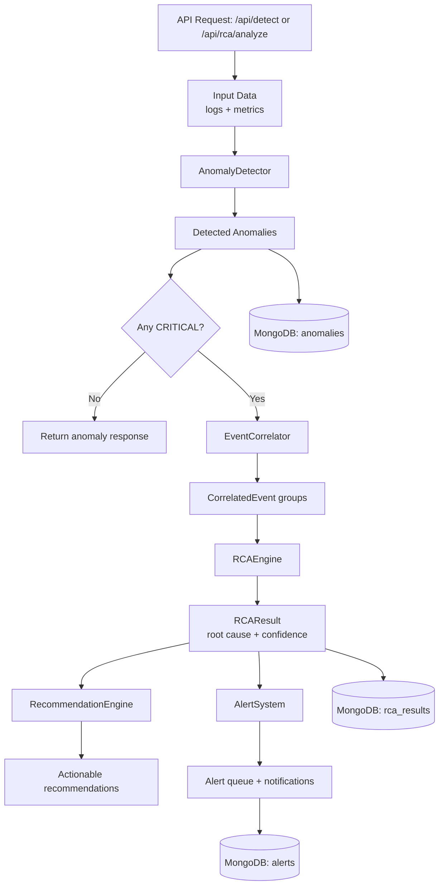

# ARCA Backend Modules Guide

This document explains what each component in `backend/modules` does, how it works, and how modules interact inside the ARCA backend system.

## Module Index

- `__init__.py`: Re-exports all public classes so callers can import from one place.
- `log_collector.py`: Reads and parses new log lines incrementally.
- `metric_collector.py`: Captures runtime system metrics (CPU, memory, disk, network).
- `anomaly_detector.py`: Detects anomalies from logs and metrics using thresholds and simple statistics.
- `event_correlator.py`: Groups related anomalies in time windows and assigns a correlation score.
- `rca_engine.py`: Matches correlated anomalies to rule patterns and determines likely root cause.
- `recommendation_engine.py`: Converts root cause into prioritized action recommendations.
- `alert_system.py`: Creates and manages alerts (including notification placeholders).
- `sliding_window.py`: Utility buffer for fixed-size recent data retention.

## End-to-End Runtime Flow

In the running backend (`backend/app.py`), the main operational pipeline is:

1. Input arrives from API (`/api/detect`) as logs and/or metrics.
2. `AnomalyDetector` detects `log_anomalies` and `metric_anomalies`.
3. If critical anomalies exist, `EventCorrelator` groups related anomalies.
4. `RCAEngine` infers root cause from correlated events.
5. `RecommendationEngine` builds prioritized fixes (in `/api/rca/analyze`).
6. `AlertSystem` raises critical alerts.
7. Results are stored in MongoDB collections (`anomalies`, `rca_results`, `alerts`).

## Interaction Diagram



## Component-by-Component Explanation

### 1) `__init__.py` (Package Facade)

Purpose:
- Central export point for module classes.

What it does:
- Imports main classes from all module files.
- Defines `__all__` for clean wildcard exports.

Example:
```python
from modules import AnomalyDetector, RCAEngine, AlertSystem
```

---

### 2) `log_collector.py` (Log Ingestion)

Purpose:
- Read only newly appended lines from a log file.

What it does:
- Maintains `last_read_position` to avoid re-reading old lines.
- Parses raw lines into structured dicts (`level`, `message`, `timestamp`, `source`).
- Supports common log patterns such as:
  - `[TIMESTAMP] LEVEL: MESSAGE`
  - `TIMESTAMP - LEVEL - MESSAGE`

Important methods:
- `read_new_logs()`: Incremental read of unread log lines.
- `parse_log_entry(line)`: Converts a raw line into normalized structured data.

Example:
```python
collector = LogCollector("/var/log/app.log", interval=5)
new_logs = collector.read_new_logs()

# Example output item
# {
#   'level': 'ERROR',
#   'message': 'Database connection failed',
#   'timestamp': datetime(...),
#   'source': '/var/log/app.log'
# }
```

---

### 3) `metric_collector.py` (System Telemetry)

Purpose:
- Capture runtime host metrics for health and anomaly checks.

What it does:
- Uses `psutil` to collect:
  - CPU usage
  - memory usage and memory MB values
  - disk usage/free space
  - network I/O stats
- Stores metric history for trend access.

Important methods:
- `get_metric_snapshot()`: Single combined metrics snapshot.
- `get_metric_history(metric_name)`: Returns recent historical samples.

Example:
```python
mc = MetricCollector(interval=10)
snapshot = mc.get_metric_snapshot()

# Possible keys:
# cpu_usage, memory_usage, disk_usage,
# bytes_sent, bytes_recv, packets_sent, packets_recv
```

---

### 4) `anomaly_detector.py` (Detection Layer)

Purpose:
- Convert raw logs/metrics into anomaly objects with severity and evidence.

What it does:
- Log anomalies:
  - Flags `ERROR` and `CRITICAL` log levels.
  - Detects deployment issue keywords (`timeout`, `rollback`, `out of memory`, etc.).
- Metric anomalies:
  - Threshold-based checks via `Threshold(min_value, max_value)`.
  - Statistical checks using rolling baseline (`mean ± k*std`).
- Persists detected anomalies in `anomaly_history`.

Key classes:
- `Threshold`: Detection config per metric.
- `Anomaly`: Structured anomaly model.
- `AnomalyDetector`: Main detector engine.

Example:
```python
thresholds = {
    'cpu_usage': Threshold(max_value=80),
    'memory_usage': Threshold(max_value=85),
}

detector = AnomalyDetector(thresholds)
metric_anomalies = detector.detect_metric_anomalies({'cpu_usage': 95.5, 'memory_usage': 88.0})

for a in metric_anomalies:
    print(a.anomaly_type, a.severity, a.description)
```

---

### 5) `event_correlator.py` (Correlation Layer)

Purpose:
- Group related anomalies into meaningful incidents.

What it does:
- Buckets anomalies into fixed time windows (`window_size_minutes`, default 5).
- Computes `correlation_score` from:
  - time proximity
  - severity mix (critical/high boost)
  - dependency relationships (if dependency graph is configured)
- Produces `CorrelatedEvent` objects containing grouped anomalies and affected components.

Important methods:
- `correlate_anomalies(anomalies)`: Main grouping/scoring entry point.
- `set_dependencies(graph)`: Injects service dependency graph.

Example:
```python
correlator = EventCorrelator(window_size_minutes=5)
correlator.set_dependencies({'app-server': ['database'], 'database': []})

groups = correlator.correlate_anomalies(metric_anomalies + log_anomalies)
print(groups[0].correlation_score if groups else 0)
```

---

### 6) `rca_engine.py` (Root Cause Analysis)

Purpose:
- Infer likely root cause from correlated anomaly patterns.

What it does:
- Applies rule patterns (`Rule`) on correlated anomalies.
- Computes confidence using rule confidence and event correlation strength.
- Builds:
  - root cause label
  - causal chain
  - evidence list
  - recommendations list
- Stores analysis history.

Default built-in cause families include:
- `DEPLOYMENT_CONFIGURATION_ERROR`
- `RESOURCE_EXHAUSTION`
- `NETWORK_CONNECTIVITY_ISSUE`
- `DATABASE_CONNECTION_FAILURE`
- `MEMORY_LEAK`

Example:
```python
engine = RCAEngine([])  # Empty list loads default rules
result = engine.analyze_root_cause(groups)

print(result.root_cause)
print(result.confidence)
print(result.causal_chain)
```

---

### 7) `recommendation_engine.py` (Action Layer)

Purpose:
- Translate RCA output into actionable, prioritized remediation steps.

What it does:
- Maps `root_cause` to recommendation rules.
- Adjusts priority based on RCA confidence.
- Reuses historical successful fixes when available.
- Sorts actions by priority (`HIGH` -> `MEDIUM` -> `LOW`).

Important methods:
- `generate_recommendations(rca_result)`
- `record_fix(root_cause, action_taken, success)`

Example:
```python
re_engine = RecommendationEngine({})
recommendations = re_engine.generate_recommendations(result)

for rec in recommendations[:3]:
    print(rec['priority'], rec['action'])
```

---

### 8) `alert_system.py` (Notification Layer)

Purpose:
- Notify operators about important incidents, especially critical anomalies.

What it does:
- Creates `Alert` records with unique IDs.
- Queues unacknowledged alerts.
- Supports alert querying and acknowledgment.
- Includes placeholder notification channels (email/slack/sms) for future integration.

Important methods:
- `send_alert(alert_data)`
- `acknowledge_alert(alert_id)`
- `get_unacknowledged_alerts()`

Example:
```python
alerts = AlertSystem()
alerts.send_alert({
    'type': 'CRITICAL_ANOMALY',
    'severity': 'CRITICAL',
    'root_cause': 'DEPLOYMENT_CONFIGURATION_ERROR',
    'confidence': 0.87,
    'anomaly_count': 4
})

pending = alerts.get_unacknowledged_alerts()
```

---

### 9) `sliding_window.py` (Utility Buffer)

Purpose:
- Keep only the most recent N data items with automatic eviction.

What it does:
- Uses `deque(maxlen=...)` to implement fixed-size circular buffer.
- Tracks metadata such as total items added and number evicted.
- Supports helpers for recency, filtering, and time-range selection.

When to use it:
- Real-time streams where only recent context matters.
- Lightweight in-memory rolling history for anomaly context.

Example:
```python
window = SlidingWindow(max_size=5)
for i in range(10):
    window.add({'id': i, 'timestamp': datetime.now()})

print(window.get_recent(3))   # Last 3 items
print(window.get_metadata())  # Includes eviction count
```

## How These Components Support the System

- Observability: `LogCollector` + `MetricCollector` gather evidence from runtime behavior.
- Detection: `AnomalyDetector` converts evidence into explicit problem signals.
- Correlation: `EventCorrelator` groups independent signals into incident-level context.
- Diagnosis: `RCAEngine` identifies most likely root cause with confidence and evidence.
- Actionability: `RecommendationEngine` provides prioritized fixes to shorten MTTR.
- Incident response: `AlertSystem` escalates critical incidents to operators.
- Stream handling utility: `SlidingWindow` enables efficient recent-history processing.

Together, these modules form a complete RCA pipeline from raw telemetry to operator action.
